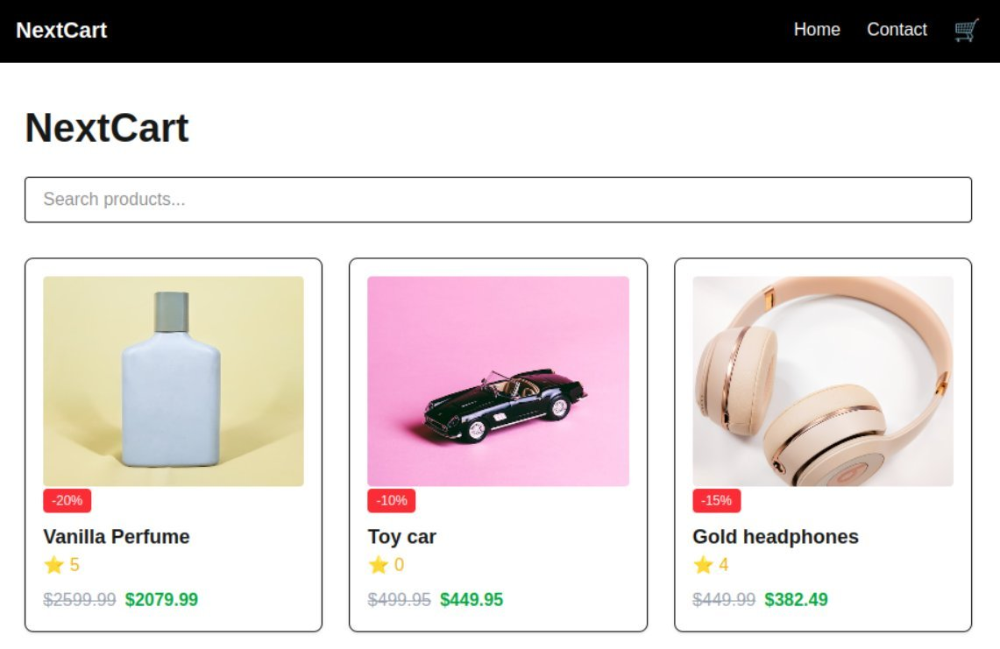

# NextCart – Online Shop

NextCart is a modern online shop built with Next.js, React, TypeScript and Tailwind CSS. Users can browse products, view product details, search for items, add products to a cart, and complete a checkout flow, using the Noroff Online Shop API.




## Description

NextCart was built as the JavaScript Frameworks course assignment. The goal was to demonstrate component-based architecture, state management and a complete user journey using a modern JavaScript framework.

The application includes:

* Product listing fetched from the Noroff Online Shop API
* Product details page
* Search functionality
* Shopping cart system
* Checkout success page
* Contact form with validation
* Responsive design

## Technologies Used
- Next.js
- React
- TypeScript
- Tailwind CSS
- Noroff Online Shop API
## Getting Started

### Installing


Clone the repository:

```bash
git clone https://github.com/NoroffFEU/jsfw-2025-v1-shamia-s-javascript-frameworks-ca
```
2. Install the dependencies:
```bash

npm install

```
### Running

To run the app, run the following command:

```bash
npm run dev
```
## Live Site

Deployed on Vercel: [Visit Live Website](https://jsfw-2025-v1-shamia-s-javascript-fr.vercel.app/)

## Contact

* [My LinkedIn page](https://www.linkedin.com/in/shamia-shamia-6892a81a2/)
* [My GitHub page](https://github.com/Shamia702)

## Acknowledgments

* Noroff front-end development course materials
* [Noroff Online Shop API](https://docs.noroff.dev/)
